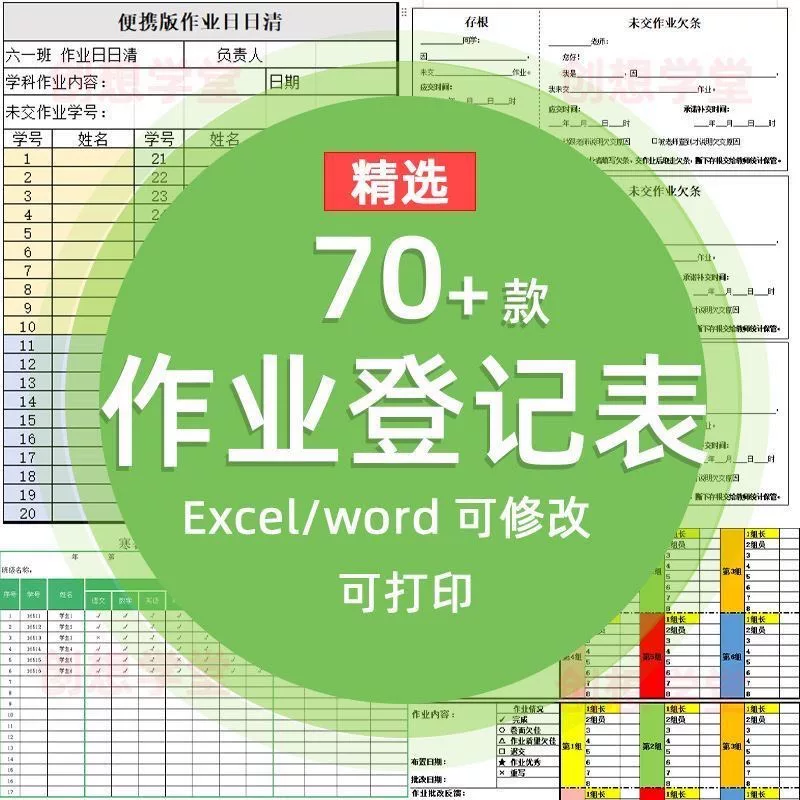

# B142 Selection of 70+ homework registration forms, Excel/Word can be modified

## Body

b142 offers a selection of over 70 work registration forms, available in both Excel and Word formats for easy modification and editing. These forms are designed to be convenient and efficient for homeroom teachers, making it easier to manage student assignments.

The product includes various types of work registration templates, essential tools for homeroom teachers, and is designed to be user-friendly and quick to use.

【Resource Introduction】
- Available in both Excel and Word formats, allowing for direct modification and editing.
- Printable versions are also available, making paper office work more convenient.
- The content is complete and categorized clearly, making it easy to understand at a glance.

【Purchase Notes】
- Orders will be sent directly to the网盘 link upon completion.
- Automated shipping is supported.
- Digital resources are non-physical items.

【Warm Reminder】
- This product is intended for learning and research purposes only.
- It should not be used for commercial purposes.
- If there are copyright issues, please contact us promptly.
For those interested, click the 'I want' button below to purchase directly!

## Images

## Payment

Here is a pay link on Stripe ( https://buy.stripe.com/3cs8yP7sY87d0vu9AB ). Please contact me lonlonago@foxmail.com after funding $89, and I will send you a complete data files , thank you!

